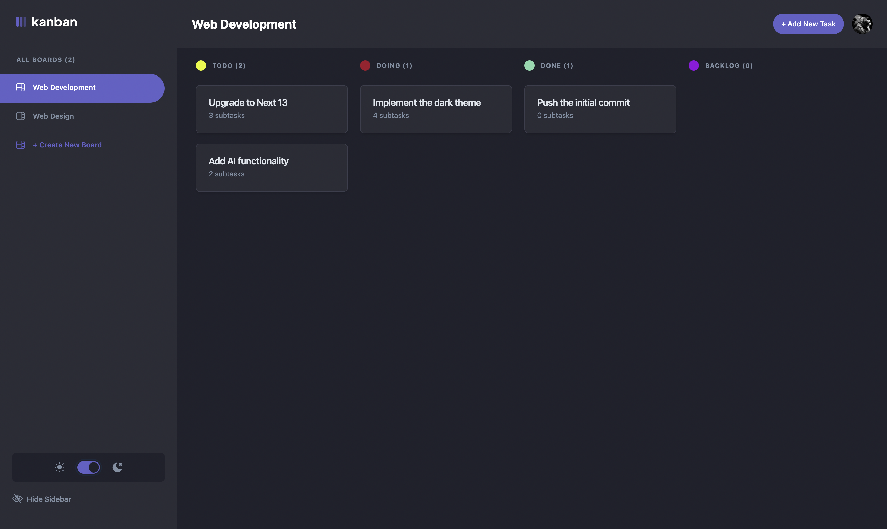

# KanFlow



[Check the live demo](https://kanflow.nouh.dev)

KanFlow is a modern, feature-rich Kanban app designed for personal productivity. Built with the latest technologies including Next.js and the T3 Stack, it offers a range of features like authentication, CRUD operations, drag and drop, and theme switching.

## Table of Contents

- [Features](#features)
- [Technology Stack](#technology-stack)
- [Getting Started](#getting-started)
- [Contributing](#contributing)
- [Upcoming Features](#upcoming-features)
- [License](#license)

## Features

- **Authentication**: Secure login using Google Auth.
- **CRUD Operations**: Easily create, read, update, and delete tasks and subtasks.
- **Drag and Drop**: Easily manage tasks and subtasks with drag and drop.
- **Dark/Light Theme**: Toggle between dark and light modes for optimal user experience.
- **Tasks/Subtasks**: Create tasks and subtasks to manage even the most complex projects.

## Technology Stack

KanFlow is built using a robust set of technologies:

- **Frontend**: Next.js, Tailwind CSS, Shadcn's UI Library
- **Backend**: T3 Stack, TRPC, Prisma
- **Database**: Supabase
- **Authentication**: NextAuth, Google Auth
- **Language**: TypeScript

## Getting Started

To get a local copy up and running, follow these steps:

1. **Clone the repository**

   ```bash
   git clone https://github.com/your-username/KanFlow.git
   ```

2. **Navigate to the project directory**

   ```bash
   cd KanFlow
   ```

3. **Install dependencies**

   ```bash
   npm install
   # or
   yarn install
   ```

4. **Setup the authentication and database**

   You can rename .env.example to .env and add your own auth and database url/passwords. You can check the following resources for more info on how to get those :
   - https://www.prisma.io/docs/guides/database/supabase
   - https://next-auth.js.org/getting-started/example
   - https://next-auth.js.org/providers/google

5. **Run the development server**

   ```bash
   npm run dev
   # or
   yarn dev
   ```

6. Open your browser and navigate to `http://localhost:3000`.

## Contributing

Contributions are what make the open-source community an amazing place to learn, inspire, and create. Any contributions you make are **greatly appreciated**.

1. Fork the Project
2. Create your Feature Branch (`git checkout -b feature/AmazingFeature`)
3. Commit your Changes (`git commit -m 'Add some AmazingFeature'`)
4. Push to the Branch (`git push origin feature/AmazingFeature`)
5. Open a Pull Request

## Upcoming Features

- **Responsive Design**: I did not make the website responsive while developping it (I know that's bad). I'll try to work on this as soon as I find some time to do so.
- **Stripe Integration**: I'd like to try to implement a SAAS like payment system where you would only have access to 2-3 Kanban before having to upgrade to a pro version. I might as well add this feature soon.

## License

Distributed under the MIT License. See `LICENSE` for more information.

---

**Built with 💖 by [Noé Zaabi](https://nouh.dev)**
